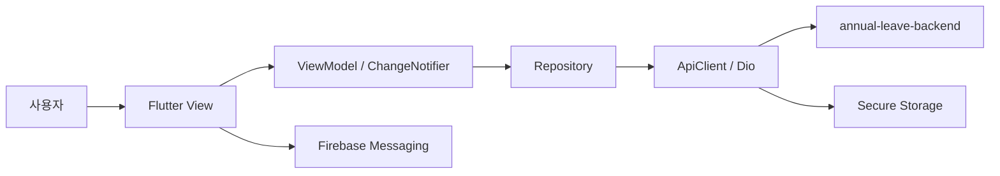

# annual_leave_frontend

`annual_leave_frontend`는 DY Infotech 사내 연차 관리 시스템의 Flutter 클라이언트입니다.
로그인/SSO, 연차 신청·조회·취소, 승인·반려, 대시보드, 사원·조직 관리와 FCM 알림 UI를 제공합니다.


## 시스템 아키텍처



- 앱 전역 상태는 `AuthSession`을 중심으로 관리합니다.
- 화면별 상태와 비동기 요청은 ViewModel이 담당합니다.
- Repository가 API 요청/응답 변환을 담당합니다.
- 공통 인증 수명주기와 Access Token 갱신은 `ApiClient`가 담당합니다.
- 서버가 권한, 조직 범위, 연차기간, 휴가 일수, 전체 조회 건수의 신뢰의 근원입니다.


## 사용 기술

| 구분 | 기술 | 비고 |
|---|---|---|
| UI | Flutter / Dart | Web 중심, Android/iOS 구성 포함 |
| 상태관리 | Provider + ChangeNotifier | `AuthSession` + 화면별 ViewModel |
| HTTP | Dio | 공통 `ApiClient` 싱글턴 |
| Access Token 저장 | flutter_secure_storage | JWT 및 SSO session marker |
| Refresh Token | HttpOnly Cookie | Web `withCredentials=true` |
| 로컬 설정 | shared_preferences | 자동 로그인, FCM 등록 상태 등 |
| 푸시 | Firebase Messaging | token 등록/해제 및 알림 처리 |
| 캘린더 | table_calendar | 연차 신청 기간 선택 |
| 날짜/다국어 | intl + flutter_localizations | `ko_KR` |
| 테스트 | flutter_test, mocktail, http_mock_adapter | ViewModel/Repository/View 테스트 |


## 기능

- **인증/SSO**: 로그인, 자동 로그인, Access Token 자동 갱신, 로그아웃, 계정 찾기, 비밀번호 재설정
- **대시보드**: 내 연차 및 현재 사용자 정보 조회
- **연차 신청**: 연차기간/공휴일 조회, 휴가 유형·기간 선택, 중복/잔여일수 사전 검증, 멱등성 키 전송
- **신청 목록**: 올해 전체 신청 기본 조회, 내 신청 필터, 상세 조회, 취소
- **무한스크롤**: 서버 cursor 기반 추가 조회와 `totalCount / hasMore` 반영
- **승인 관리**: 승인 대기, 승인/반려, 처리 목록 검색
- **사원/조직 관리**: 사원 등록·조회·수정, 관리팀 설정, 부서/팀 관리
- **FCM**: token 동기화, 알림 수신, 로그아웃/세션 만료 정리


## 화면 / Route

| Route | 화면 |
|---|---|
| `/login` | 로그인 |
| `/signup` | 사용 등록 |
| `/forgot-password` | 계정 찾기 / 비밀번호 재설정 |
| `/dashboard` | 대시보드 |
| `/leave-request` | 연차 신청 |
| `/all-leave-requests` | 전체 신청 목록 + 내 신청 필터 |
| `/pending-approval` | 승인 대기 |
| `/signup_manage_screen` | 사용자 등록 관리 |
| `/search_employee_number_screen` | 사번 조회 |
| `/admin-settings` | 관리자별 관리팀 설정 |
| `/department-team-manage` | 부서/팀 관리 |
| `/my-info` | 내 정보 |

별도 `/my-leave-requests` route는 사용하지 않습니다.
내 신청 목록은 `/all-leave-requests` 화면의 필터로 제공합니다.


## 인증 / 권한

- Access JWT는 secure storage에 저장합니다.
- Refresh Token은 JavaScript에서 직접 읽지 않는 HttpOnly Cookie로 관리합니다.
- Web에서는 Dio 요청에 cookie가 포함되도록 `withCredentials=true`를 사용합니다.
- Access Token이 만료되기 약 45초 전이면 선제 갱신합니다.
- 일반 API 요청이 401이면 Refresh 후 최대 1회 재시도합니다.
- 여러 동시 Refresh 요청은 single-flight로 합칩니다.
- 브라우저 탭 간 Refresh Cookie 변경은 shared SSO lock과 session marker로 조정합니다.
- 401/403으로 Refresh Session 무효가 확정된 경우에만 로그인 상태를 만료시킵니다.
- 네트워크 장애나 5xx는 자동 로그아웃 사유로 취급하지 않습니다.

관리자 메뉴 노출과 `AuthSession.isAdmin`은 UX용 상태입니다.
**실제 접근 권한은 backend가 요청마다 검증합니다.**

세부 동시성 규칙은 `IMPLEMENTATION.md`를 기준으로 합니다.


## 연차 신청 / 목록 정책

- 연차기간은 `/api/leave-requests/my/period` 응답을 우선 사용합니다.
- 기간 조회 실패 시에만 현재 연도 1/1~12/31을 fallback으로 사용합니다.
- 클라이언트의 중복/잔여일수 검사는 UX용 사전 검증이며 최종 판정은 backend가 수행합니다.
- 신청 시 payload에 대응하는 `Idempotency-Key`를 유지하여 재시도 중 중복 생성을 방지합니다.
- `/all-leave-requests`는 **모든 사용자에게 올해 전체 신청을 기본 조회**합니다.
- 내 신청만 보고 싶을 때는 화면의 `내 신청` 필터를 사용합니다.


## 페이지네이션 / 무한스크롤

휴가 목록 API는 다음 응답 계약을 사용합니다.

```text
items       현재 페이지 데이터
totalCount  동일 검색조건의 전체 건수
hasMore     다음 데이터 존재 여부
```

- 기본 페이지 크기는 50건입니다.
- 전체 건수는 현재 로드된 `items.length`가 아니라 서버의 `totalCount`를 표시합니다.
- 다음 페이지 여부는 목록 길이로 추정하지 않고 서버의 `hasMore`를 사용합니다.
- 일반 신청 목록은 `cursorRequestedAt + cursorRequestId`를 사용합니다.
- 승인/반려/승인대기 목록은 `cursorCreatedAt + cursorRequestId`를 사용합니다.
- 200건 hard cap은 없습니다. `hasMore=true`인 동안 계속 조회합니다.


## API 주소

`ApiConfig`의 우선순위:

```text
--dart-define=API_BASE_URL
    >
debug 기본 개발 주소
    >
release/profile 운영 주소
```

기본 주소:

- Web/Desktop debug: `http://localhost:8080`
- Android emulator debug: `http://10.0.2.2:8080`
- Release/Profile: `https://app.dyinfotech.com`

실기기나 별도 개발 서버를 사용할 때:

```bash
flutter run --dart-define=API_BASE_URL=http://192.168.0.10:8080
```


## 테스트 / CI

GitHub Actions CI는 `develop_v2.0`, `release` push와 대상 PR에서 다음을 수행합니다.

```text
flutter pub get
→ flutter analyze --no-fatal-infos
→ flutter test
→ flutter build web --release
```

ViewModel 테스트는 stale response 방지, cursor 무한스크롤, 200건 초과 조회, 인증/세션 경합 등의 회귀를 포함합니다.


## 배포

- `release` push → Frontend CD 자동 실행
- `workflow_dispatch` → 선택한 ref 수동 배포
- `flutter build web --release`
- `build/web`을 서버 임시 경로에 업로드
- `/opt/annual-leave/front/web`에 반영
- 최종 파일 owner는 `www-data:www-data`


## 빌드 / 실행 방법

### 의존성 설치

```bash
flutter pub get
```

### 개발 실행

```bash
flutter run -d chrome
```

### 정적 분석 / 테스트

```bash
flutter analyze --no-fatal-infos
flutter test
```

### Web release build

```bash
flutter build web --release
```


## 구현 규칙

인증 경합, 브라우저 탭 간 SSO, ViewModel stale response 방지, 연차 신청 멱등성, cursor 무한스크롤, FCM lifecycle처럼 수정 시 유지해야 할 세부 규칙은 [IMPLEMENTATION.md](IMPLEMENTATION.md)에 정리합니다.
