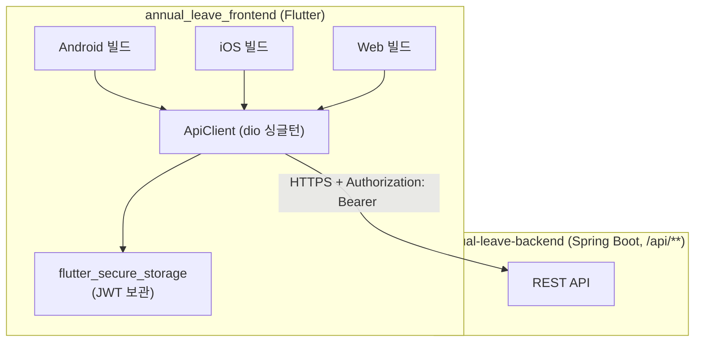

# 01. 시스템 아키텍처

## 1.1 개요

`annual_leave_frontend`는 연차 관리 앱의 클라이언트로, **Flutter(Dart) 크로스플랫폼 앱**입니다. 단일 코드베이스(`lib/`)로 **Android, iOS, Web** 세 플랫폼을 빌드합니다(React/Next.js 웹 프론트엔드가 아님).

- **역할**: 백엔드(`annual-leave-backend`, Spring Boot) REST API의 UI 클라이언트. 뷰 렌더링·상태 보관·폼 검증을 담당하며, 비즈니스 로직(연차 계산, 승인 규칙 등)은 전부 백엔드에 위임합니다.
- **백엔드 관계**: JWT Bearer 인증으로 `/api/**`를 호출합니다. 엔드포인트 상세는 [백엔드 08-api-conventions.md](../../annual-leave-backend/docs/08-api-conventions.md) 참조.

## 1.2 시스템 구성도

## 1.3 플랫폼별 baseUrl

환경변수가 아니라 `lib/config/api_config.dart`에 **플랫폼 분기 + 하드코딩**되어 있습니다.

| 플랫폼 | baseUrl(현재 활성) | 비고 |
|---|---|---|
| Web(`kIsWeb`) | `https://api.dyinfotech.com` | `http://localhost:8080`은 주석 처리되어 있어 로컬 전환 시 수동 교체 필요 |
| Android | `https://api.dyinfotech.com` | 로컬 개발용 `http://10.0.2.2:8080`(에뮬레이터), `http://192.168.0.5:8080`(실기기)이 주석으로 남아있음 |
| iOS(시뮬레이터) | `http://localhost:8080` | 실기기 테스트 시 `http://192.168.0.5:8080`으로 교체 필요(주석) |

로컬 개발 환경 전환 방법은 [02. 개발 환경](02-dev-environment.md) 참조.

## 1.4 기술 스택

| 구분 | 기술 | 비고 |
|---|---|---|
| 언어/프레임워크 | Flutter(Dart) `>=3.5.0 <4.0.0` | `pubspec.yaml` |
| 상태관리 | `provider ^6.1.2`(`ChangeNotifier`) | Redux/Riverpod/BLoC 아님 |
| HTTP 클라이언트 | `dio ^5.7.0` | axios/fetch 대응, 싱글턴(`ApiClient`) |
| 보안 저장소 | `flutter_secure_storage ^9.2.2` | JWT 저장(OS Keychain/Keystore) |
| 캘린더 UI | `table_calendar ^3.1.2` | 연차 신청 화면의 날짜 선택 |
| 폰트/국제화 | `google_fonts`(Noto Sans KR), `intl`, `flutter_localizations` | UI는 한국어 고정, 다국어 전환 기능 없음 |
| 린트 | `flutter_lints ^6.0.0` | 커스텀 규칙 없음(기본값) |
| 앱 아이콘 | `flutter_launcher_icons ^0.14.1` | `assets/icon/app_icon.png` 기반 생성 |

> React 대응 개념(TypeScript, Vite/Webpack, React Query, react-hook-form 등)은 이 프로젝트에 해당하지 않습니다. Dart는 정적 타입 언어이며, 상태관리·폼·서버캐싱은 모두 수동/Provider 패턴으로 직접 구현되어 있습니다(상세: [03](03-app-architecture.md), [05](05-data-models-api-integration.md)).

## 1.5 배포 대상 (있는 그대로)

- **Web**: Vercel(`annual-leave-frontend.vercel.app`)에 배포되어 있으나, 저장소에 `vercel.json`/`next.config` 등 커밋된 배포 설정이 없습니다. `test-web-deploy` 브랜치에 ngrok 터널링 URL 적용 커밋("웹 배포 테스트용 터널링 URL 적용", "ngrok 경고 페이지 우회 헤더 추가")이 남아 있어, **`flutter build web` 산출물을 Vercel 대시보드에서 정적 사이트로 수동 배포**한 것으로 추정됩니다(추정 — 실제 배포 파이프라인은 확인 필요).
- **Android/iOS**: 스토어 배포 자동화(Fastlane 등) 없음. 로컬 빌드 후 수동 배포로 추정.
- **CI/CD**: `.github/workflows` 없음 — 빌드/테스트/배포 전 과정이 CI 없이 로컬에서 수행되는 것으로 보입니다.

상세는 [07. 배포/운영](07-deployment-operations.md) 참조.

## 1.6 백엔드와의 기능적 연동 범위

| 기능 | 사용 여부 |
|---|---|
| JWT 인증 | 사용(전 화면) |
| FCM 푸시 알림 | **백엔드는 지원하나 프론트엔드에는 Firebase 관련 코드가 전혀 없음(미구현)** |
| 공휴일 동기화 API | 사용(연차 신청 캘린더의 주말/공휴일 표시) |
| 관리자 승인/반려 | 사용 |
| OpenAPI/Swagger 문서 소비 | 해당 없음(백엔드 springdoc 비활성 상태) |
