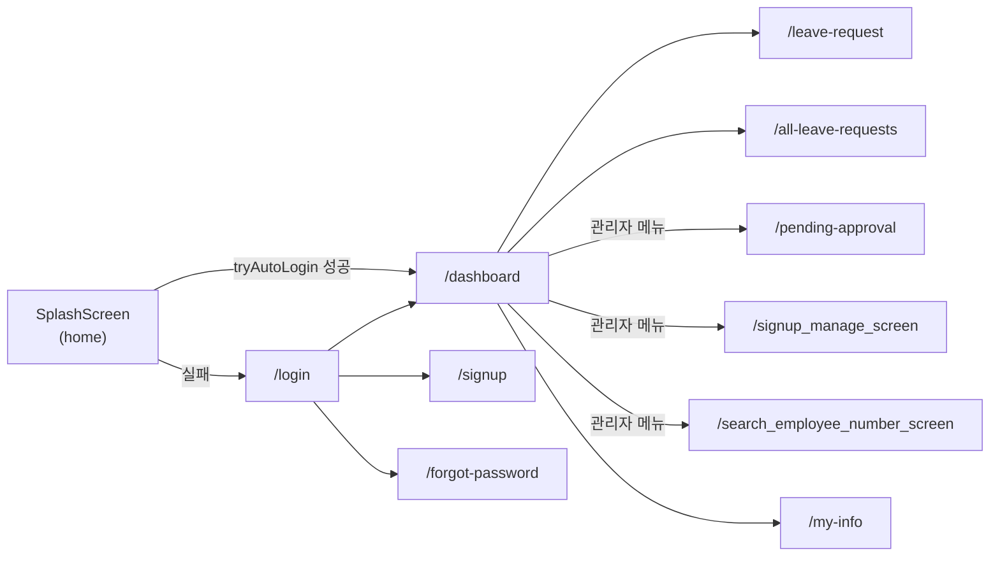

# 03. 앱 아키텍처

## 3.1 디렉토리 구조

```
lib/
├── main.dart                # MaterialApp, 라우트 테이블, 전역 Provider 등록, SplashScreen
├── config/
│   └── api_config.dart      # 플랫폼별 baseUrl 하드코딩
├── models/                  # 요청/응답 모델 (수동 fromJson/toJson)
│   ├── auth_models.dart
│   ├── dashboard_models.dart
│   ├── employee.dart
│   ├── leave_request_models.dart
│   ├── public_holiday.dart
│   └── enums/
│       ├── LeaveState.dart
│       ├── LeaveType.dart
│       └── RoleType.dart
├── providers/                # 상태관리 (ChangeNotifier)
│   ├── auth_provider.dart
│   ├── dashboard_provider.dart
│   ├── leave_request_list_provider.dart
│   └── public_holiday_provider.dart
├── screens/                  # 화면(페이지) — 각 파일이 라우트 하나에 대응
│   ├── login_screen.dart
│   ├── signup_screen.dart
│   ├── forgotPasswordScreen.dart
│   ├── dashboard_screen.dart
│   ├── leave_request_screen.dart
│   ├── all_leave_requests_screen.dart
│   ├── my_leave_requests_screen.dart   # 미사용(라우트 미등록, 아래 참조)
│   ├── pending_approval_screen.dart
│   ├── signup_manage_screen.dart
│   ├── search_employee_number_screen.dart
│   └── my_info_screen.dart
├── services/
│   └── api_client.dart       # dio 싱글턴 + JWT 인터셉터
├── theme/
│   └── app_theme.dart        # AppColors 팔레트 + Material3 ThemeData
└── widgets/                  # 재사용 위젯
    ├── app_drawer.dart
    ├── leave_status_badge.dart
    └── registe_status_badge.dart
```

`lib/memo/`(memo1, memo2)는 확장자 없는 스크래치 파일로, 실제 코드에서 import되지 않는 **미사용 레거시**입니다(문서화 대상 아님, 정리 후보).

## 3.2 레이어링

```
Screen(Widget) → Provider(ChangeNotifier) → ApiClient(dio) → 백엔드 /api/**
                      ↑                           ↓
                 notifyListeners()          Authorization 헤더 자동 첨부
```

- **Screen**: `StatefulWidget` + `TextEditingController`/`setState`로 폼과 로컬 UI 상태를 직접 관리.
- **Provider**: `ChangeNotifier` 기반. `main.dart`에서 `MultiProvider`로 4개를 루트에 등록:
  - `AuthProvider` — 로그인 상태, JWT 발급/삭제, 내 정보(`Employee`).
  - `DashboardProvider` — 대시보드 데이터.
  - `LeaveRequestListProvider` — 내 연차 신청 목록(중복 신청 검사에도 재사용).
  - `PublicHolidayProvider` — 올해/내년 공휴일.
- **ApiClient**: `lib/services/api_client.dart`의 dio 싱글턴 하나만 존재. **별도 서비스 레이어(`services/leave_request_service.dart` 등)로 엔드포인트가 정리되어 있지 않고**, Provider와 화면 양쪽에서 `ApiClient().dio.get/post/patch/delete(...)`를 직접 호출합니다. 상세 매핑은 [05. 데이터 모델 및 API 연동](05-data-models-api-integration.md) 참조.

> React Query/SWR류의 서버 상태 캐싱은 없습니다. 화면에 진입할 때마다 Provider의 fetch 메서드를 수동 호출해 다시 불러옵니다.

## 3.3 라우팅

`lib/main.dart`(54~77행) `MaterialApp.routes`에 named route로 등록되어 있습니다. 최초 진입점은 `home: const SplashScreen()`이며, 별도 라우트 이름은 없습니다.

| 라우트 | 화면 | 접근 |
|---|---|---|
| (`home`) | `SplashScreen` | 자동 로그인 시도 후 `/dashboard` 또는 `/login`으로 분기 |
| `/login` | `LoginScreen` | 공개 |
| `/signup` | `SignupScreen` | 공개(관리자가 미리 등록한 사번으로 가입) |
| `/forgot-password` | `FindAccountScreen`(`forgotPasswordScreen.dart`) | 공개, 탭으로 아이디 찾기/비밀번호 찾기 전환 |
| `/dashboard` | `DashboardScreen` | 로그인 필요 |
| `/leave-request` | `LeaveRequestScreen` | 로그인 필요 |
| `/all-leave-requests` | `AllLeaveRequestsScreen` | 로그인 필요(관리자 제한 없음 — [05 §5.4](05-data-models-api-integration.md#54-알려진-불일치-크로스-레포-검증-결과) 참조) |
| `/pending-approval` | `PendingApprovalScreen` | 드로어에서는 관리자에게만 노출(라우트 자체 가드는 없음) |
| `/signup_manage_screen` | `SignupManageScreen` | 위와 동일 |
| `/search_employee_number_screen` | `SearchEmployeeNumberScreen` | 위와 동일 |
| `/my-info` | `MyInfoScreen` | 로그인 필요 |

**미사용 화면**: `my_leave_requests_screen.dart`(`MyLeaveRequestsScreen`)는 파일은 존재하지만 `main.dart`의 import(16, 66행)와 라우트 등록이 모두 주석 처리되어 있습니다. `all_leave_requests_screen.dart`로 기능이 대체된 것으로 보이며, 삭제 후보입니다.



## 3.4 공통 위젯

| 위젯 | 파일 | 역할 |
|---|---|---|
| `AppDrawer` | `widgets/app_drawer.dart` | 모든 화면이 공유하는 사이드 네비게이션. 로그인 사용자 정보 표시, `auth.isAdmin`에 따라 관리자 메뉴 3개를 조건부로 추가, 로그아웃 처리 |
| `LeaveStatusBadge` | `widgets/leave_status_badge.dart` | 휴가 상태(PENDING/APPROVED/REJECTED/CANCELLED)를 색상 뱃지로 표시(Dart 3 `switch` 패턴) |
| `RegisteStatusBadge` | `widgets/registe_status_badge.dart` | 직원의 앱 가입(등록) 여부 뱃지 |

별도의 공용 컴포넌트 폴더 없이, 각 화면 파일 하단에 private 위젯(`_StatRow`, `_InfoRow` 등)을 로컬로 정의하는 패턴이 반복됩니다 — React의 "파일 내 서브컴포넌트"와 유사합니다.

**공통 레이아웃(Shell)은 없습니다.** 각 화면이 개별적으로 `Scaffold(appBar: ..., drawer: const AppDrawer(), body: ...)`를 반복 구현합니다.

## 3.5 화면 재진입 시 자동 새로고침

`main.dart`(22행)에 전역 `RouteObserver<PageRoute> routeObserver`를 두고, `DashboardScreen`이 `RouteAware`를 구현하여(`didChangeDependencies`에서 구독, `didPopNext`에서 재조회) 다른 화면(승인 처리, 연차 신청 등)에서 대시보드로 돌아올 때 자동으로 데이터를 다시 불러옵니다.

## 3.6 테마

`lib/theme/app_theme.dart`의 `AppColors`가 색상 팔레트를 정의합니다: `slate`(주 색상), `sage`(승인/잔여/긍정), `amber`(대기), `coral`(반려/경고/오류), `background`/`surface`/`textPrimary`/`textMuted`/`divider`. Material3 `ColorScheme.fromSeed(seedColor: slate)` 기반으로 커스텀, 폰트는 `google_fonts`의 Noto Sans KR.

## 3.7 주의점 / 제안

- **서비스 레이어 미통합**: 엔드포인트 호출이 Provider와 화면에 산재되어 있어 API 변경 시 영향 범위 파악이 어렵습니다. `lib/services/`에 기능별 API 함수를 모으는 리팩터링을 권장([05 §5.3](05-data-models-api-integration.md) 참조).
- **미사용 화면 정리**: `my_leave_requests_screen.dart` 삭제 여부 확인 필요.
- **`lib/memo/`**: 실제 사용되지 않는 스크래치 코드로 저장소에서 제거를 검토.
