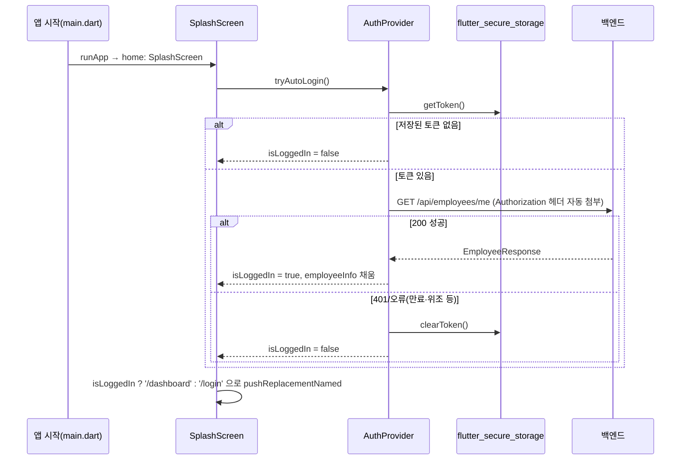

# 06. 인증 / 보안

백엔드 인증 체계 전반은 [백엔드 06-security-authentication.md](../../annual-leave-backend/docs/06-security-authentication.md) 참조. 이 문서는 클라이언트 측 구현을 다룹니다.

## 6.1 JWT 저장

`lib/services/api_client.dart`가 `flutter_secure_storage`(iOS Keychain / Android Keystore, key `jwt_token`)에 토큰을 저장합니다. `localStorage`나 평문 쿠키가 아닌 **OS 보안 저장소**를 사용합니다.

```dart
Future<void> saveToken(String token) => _storage.write(key: _tokenKey, value: token);
Future<String?> getToken() => _storage.read(key: _tokenKey);
Future<void> clearToken() => _storage.delete(key: _tokenKey);
```

## 6.2 요청 시 자동 첨부

dio `onRequest` 인터셉터가 매 요청마다 저장된 토큰을 읽어 헤더에 붙입니다.

```dart
onRequest: (options, handler) async {
  final token = await _storage.read(key: _tokenKey);
  if (token != null) {
    options.headers['Authorization'] = 'Bearer $token';
  }
  return handler.next(options);
},
```

## 6.3 자동 로그인 흐름 (앱 시작 시)



`AuthProvider.tryAutoLogin()`(`lib/providers/auth_provider.dart` 25~42행)이 토큰 유효성을 **`/api/employees/me` 호출 성공 여부로 판단**합니다(JWT 자체의 만료 여부를 클라이언트에서 직접 파싱하지 않음).

## 6.4 로그인 / 로그아웃

- **로그인**: `AuthProvider.login()` → `POST /api/auth/signin` → 응답 `token/role/name` 저장, 이어서 `fetchMyInfo()`로 상세 정보 로드.
- **로그아웃**: `AuthProvider.logout()` → `clearToken()` + 상태 초기화. `AppDrawer`가 `Navigator.pushNamedAndRemoveUntil(context, '/login', (route) => false)`로 네비게이션 스택을 전부 비우고 로그인 화면으로 이동. **백엔드 `POST /api/auth/logout`은 호출하지 않습니다**([05 §5.3](05-data-models-api-integration.md#53-엔드포인트-매핑표) 참조).

## 6.5 ⚠️ 세션 만료(401) 처리 없음

dio 인터셉터의 `onError`는 에러 메시지를 가공할 뿐, **`statusCode == 401`을 감지해 강제 로그아웃/로그인 화면으로 리다이렉트하는 로직이 어디에도 없습니다.**

영향: 토큰 만료 후 사용자가 화면 내에서 API를 호출하면(예: 연차 신청, 목록 조회) 매번 그 화면의 일반적인 에러 메시지("~에 실패했습니다")만 보게 되고, 왜 실패하는지(세션 만료) 알 수 없는 상태로 남습니다. 앱을 재시작해야 `SplashScreen`의 `tryAutoLogin()`이 다시 검증해 로그인 화면으로 보내줍니다.

**개선 제안**: `ApiClient`의 `onError`에서 `error.response?.statusCode == 401`일 때 토큰을 지우고 전역적으로 로그인 화면으로 이동시키는 처리(예: 전역 `NavigatorKey` 사용) 추가를 권장합니다.

## 6.6 역할 기반 UI의 한계

- 역할은 로그인 응답의 `role`(`ADMIN`/`EMPLOYEE`)에서 오며 `AuthProvider.isAdmin` getter로 노출됩니다.
- **`AppDrawer`가 관리자 메뉴 3개(승인 대기/사용자 등록 관리/사번 조회)를 `if (auth.isAdmin)`으로 조건부 렌더링**하지만, 이는 **드로어의 메뉴 항목만 숨기는 것**이며 다음 보호 장치는 없습니다:
  - 라우트 자체에는 가드가 없어, URL(딥링크)이나 `Navigator.pushNamed`를 직접 호출하면 관리자 화면(`PendingApprovalScreen`, `SignupManageScreen`, `SearchEmployeeNumberScreen`)이 **그대로 렌더링**됩니다(화면 자체는 권한 검사를 하지 않음, [04 §4.7~4.9](04-screens-catalog.md) 참조).
  - 실제 데이터 보호는 전적으로 **백엔드 `hasRole(ADMIN)`**(`/api/admin/**`)에 의존합니다. 일반 직원이 관리자 화면에 진입해도 API 호출이 403으로 실패해 데이터는 보호되지만, **UI 껍데기와 에러 메시지가 노출**되는 사용자 경험상 허점은 있습니다.
  - `/api/leave-requests/all`은 `/api/admin/**`에 속하지 않아 이 보호망 밖에 있습니다 — [05 §5.4](05-data-models-api-integration.md#54-알려진-불일치-크로스-레포-검증-결과)의 두 번째 항목 참조.

## 6.7 기타 관찰 사항

- 사번 입력 필드는 `TextCapitalization.characters`만 적용되고 별도 형식 검증(정규식 등)이 없습니다 — 형식 오류는 전적으로 백엔드 응답(401 "사번 또는 비밀번호가 일치하지 않습니다")에 의존합니다.
- 이메일 필드도 `TextInputType.emailAddress` 키보드 힌트만 있을 뿐 클라이언트 측 정규식 검증은 없습니다(`@Email` 형식 검증은 백엔드 전담).
- 디버그 흔적(`e.toString()` 직접 노출, `print()` 로그)이 로그인/가입/계정찾기 화면에 남아 있어 운영 빌드에서 내부 오류 정보가 사용자에게 노출될 수 있습니다 — [04 §4.1~4.3](04-screens-catalog.md) 참조.

## 6.8 주의점 / 제안 요약

| 항목 | 현황 | 제안 |
|---|---|---|
| 401 처리 | 없음(§6.5) | 인터셉터에서 전역 로그아웃/리다이렉트 |
| 라우트 가드 | 없음(§6.6) | 관리자 화면 진입 시 `auth.isAdmin` 체크 후 즉시 리다이렉트 |
| 로그아웃 시 서버 통지 | 없음(§6.4) | `POST /api/auth/logout` 호출 추가 |
| 디버그 노출 코드 | 로그인/가입/계정찾기 화면에 잔존 | 운영 배포 전 제거 |
| `/api/leave-requests/all` 노출 범위 | 전 직원 접근 가능 | 백엔드/프론트 중 하나에서 관리자 제한 검토 |
